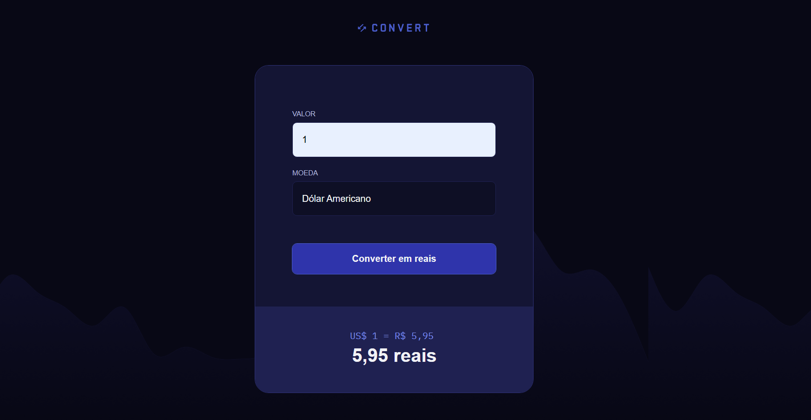

# Convert

Convert é uma aplicação web de conversão de moedas para real (BRL). Com ela, você pode converter valores das principais moedas estrangeiras para reais de forma rápida e prática.

# Funcionalidades

- Converter valores de Dólar (USD), Euro (EUR) e Libra Esterlina (GBP) para Real (BRL).

- Validação para impedir entrada de caracteres não numéricos.

- Exibição do valor convertido em tempo real.

- Exibição da taxa de conversão utilizada.

# Captura de Tela

